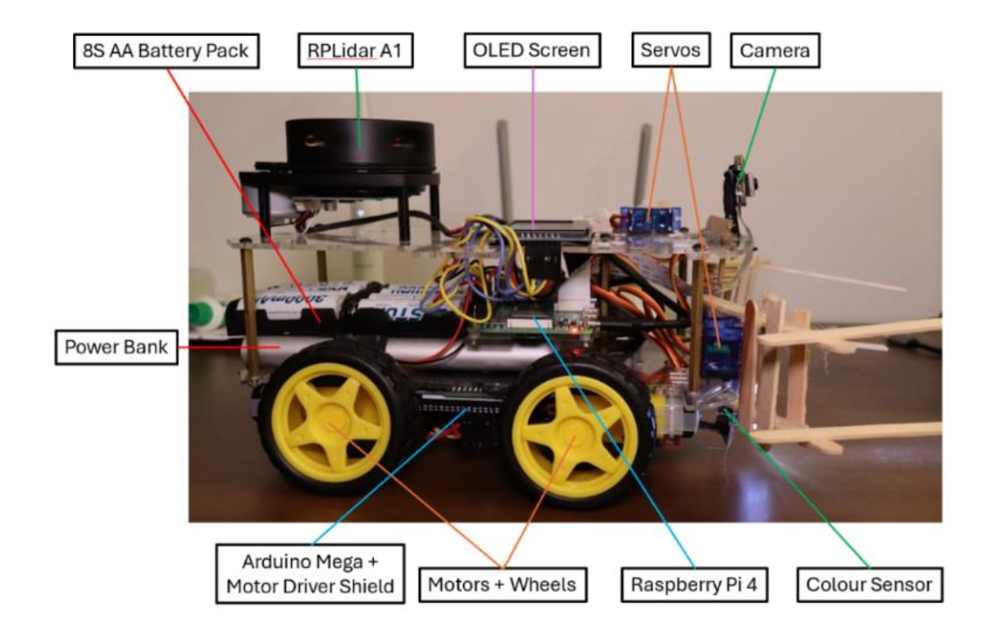
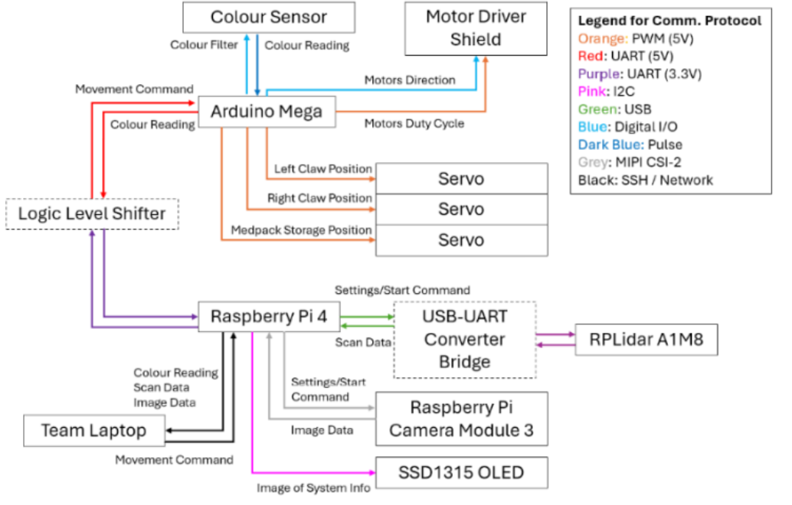
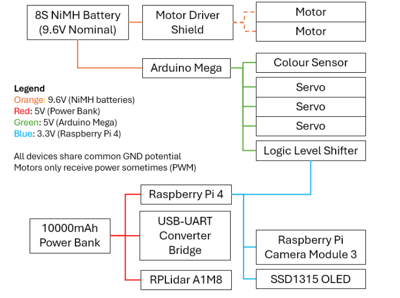
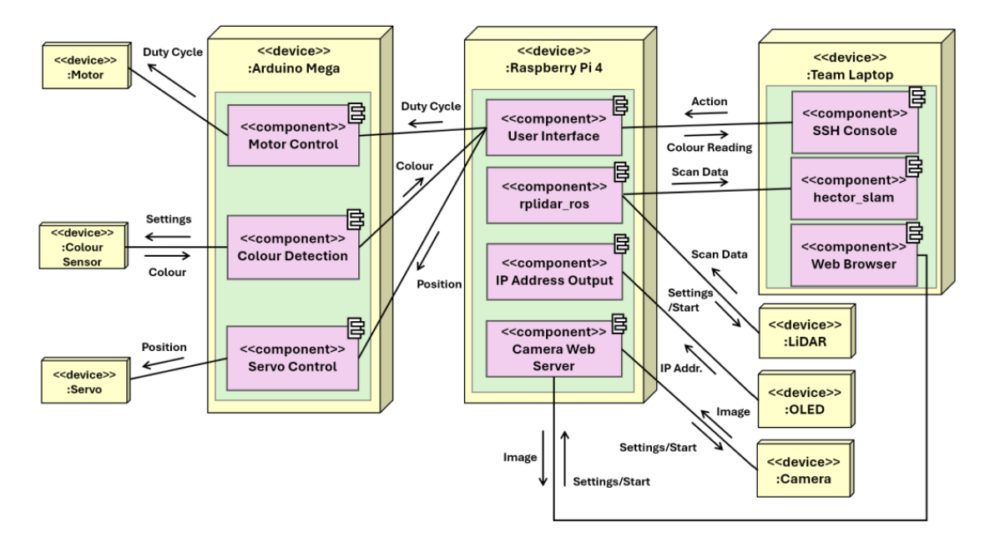
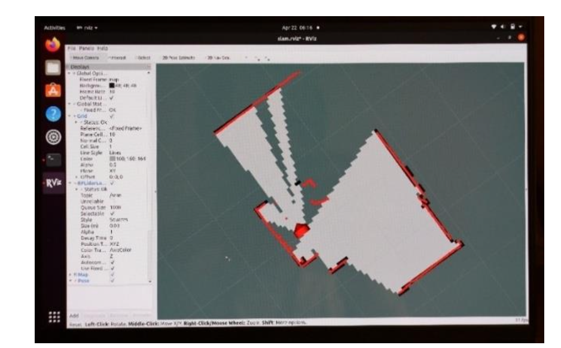

# Alex: Search & Rescue Robot 🤖

A custom-built teleoperated robot equipped with LiDAR mapping, colour recognition, and servo-based object manipulation — designed for simulated disaster environments.

### Robot Build  

---

## Overview

**Alex** is a lightweight mobile robot designed to navigate unknown environments while detecting and interacting with objects (astronauts) based on colour classification. Controlled remotely via keyboard, it streams LiDAR data for 2D SLAM mapping and handles physical tasks like medpack delivery and object pickup.

---

## 🛠 Features

- 🔧 **Modular Hardware Design**: Arduino + Raspberry Pi integration with sensor fusion
- 🗺 **SLAM Mapping**: 2D environment visualization using Hector SLAM + RViz
- 🎮 **Real-Time Teleoperation**: Keyboard control with serial command interface
- 🎯 **Colour Detection**: TCS3200 sensor with custom lens for accurate RGB filtering
- 📦 **Object Interaction**: Claw manipulation and medpack delivery via servo motors
- 🧠 **Bare-metal Programming**: Optimized firmware using timers and interrupts

---

## ⚙️ Tech Stack

| Layer        | Tools / Libraries                        |
|--------------|-------------------------------------------|
| Embedded     | Arduino Mega (C++, bare-metal, AFMotor) |
| Edge Compute | Raspberry Pi 4 (Raspbian Lite)           |
| Middleware   | ROS Noetic, rviz, rplidar_ros, hector_slam |

---

## 🔩 Hardware Components

- Raspberry Pi 4
- Arduino Mega 2560
- RPLiDAR A1
- TCS3200 Colour Sensor + M12 Lens
- SSD1315 OLED Display
- 4x DC Motors (with motor drivers)
- Servo Motors (claw & medpack mechanisms)
- Logic level shifters for UART

---

## 📸 Screenshots

### Communications Architecture  

### Power Architecture  

### Program Architecture  

### RViz SLAM Output  

---
For an in-depth explanation of the robot’s design, hardware-software architecture, and implementation details, you can refer to our comprehensive final report:

📘 [**Alex to the Rescue – Final Report (PDF)**](Final_Report.pdf)
